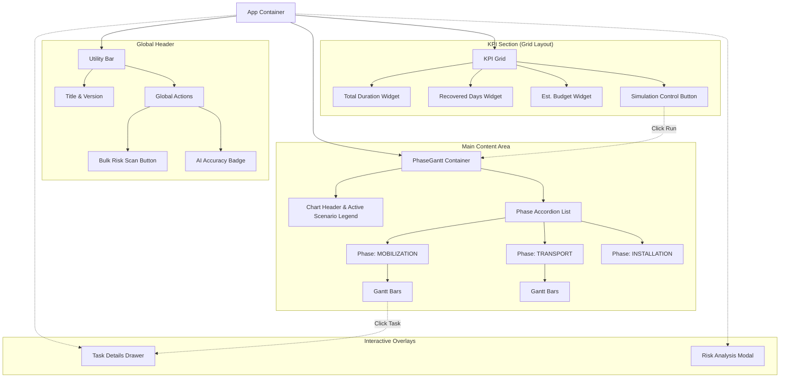
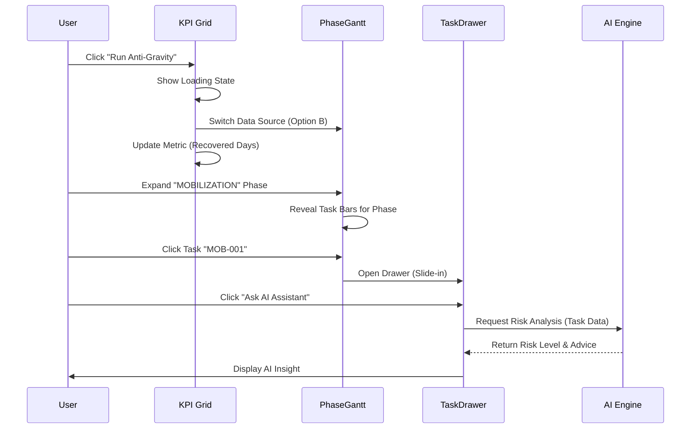

# Dashboard Screen Composition & Architecture

This document outlines the visual structure and component hierarchy of the **ADNOC HVDC Scheduler AI** dashboard. It provides a graphical representation of the user interface layout and the flow of interactions.

## 1. High-Level Screen Layout

The dashboard follows a **Single Page Application (SPA)** layout with a persistent header, a KPI summary grid, and a central workspace for the schedule visualization, augmented by an interactive details drawer.

## 2. Component Detail Specification

### 2.1 Header Area
*   **Purpose**: Branding and global utilities.
*   **Elements**:
    - **Project Title**: "ADNOC HVDC Scheduler AI"
    - **Sub-text**: "Anti-Gravity Engine v2.0 Active"
    - **Risk Scan**: Triggers project-wide risk assessment algorithm (showing 🔥/⚠️).
    - **AI Badge**: Displays confidence score (e.g., "AI Accuracy 94%").
    - **View Tabs**: "Hierarchical (Read-Only)" vs "Interactive (P6 Style)".

### 2.2 KPI & Control Grid
*   **Purpose**: High-level metrics and scenario switching.
*   **Layout**: 4-Column Grid.
*   **Components**:
    1.  **Total Duration**: Shows project length (Dynamic: Option A vs B).
    2.  **Recovered Days**: Calculates time saved (`Baseline - Optimized`). Highlights positive impact in green.
    3.  **Est. Budget**: Financial summary.
    4.  **Control Button**: Interactive button to "Run Anti-Gravity" (Switch to Option B) or "Reset" (Back to Option A).

### 2.3 Hierarchical Gantt Chart (`PhaseGantt`)
*   **Purpose**: Visualization of the project timeline managed by Phases.
*   **Interaction**: Accordion style (Expand/Collapse).
*   **Structure**:
    *   **Sticky Header**: Shows timeline range (Days) and persists on scroll.
    *   **Accordion Items**: grouped by `Phase`.
    *   **Gantt Rows**: Each row represents a task.
        *   **Left**: Task Name.
        *   **Bar**: Visual length proportional to duration. Color-coded by Phase.

### 2.4 Task Detail Drawer (`TaskDrawer`)
*   **Purpose**: Deep-dive analysis for a selected task without leaving the main view.
*   **Trigger**: Clicking any Gantt bar.
*   **Content**:
    *   **Header**: Task Name, ID, Phase Badge.
    *   **Metrics**: Duration, Owner.
    *   **Notes**: Raw log data or constraints.
    *   **AI Analyst**:
        *   **Button**: "Ask AI Assistant"
        *   **Result**: Risk Level (High/Low), text analysis, and actionable recommendation.

### 2.5 Interactive Gantt (`InteractiveGantt`)
*   **Purpose**: Editable, professional scheduling view (Primavera P6 replacement).
*   **Visuals**:
    *   **Milestones**: Diamond shapes (◆).
    *   **Risks**: Left-border color codes (Red=Critical, Orange=High) + Icons.
    *   **Grouping**: Grouped by **Voyage/Shipment** instead of generic phases.
*   **Features**:
    *   **Drag & Drop**: Moving a task auto-updates dependent tasks.
    *   **Save Button**: Persists changes to backend CSVs.

## 3. Interaction Flow Logic

