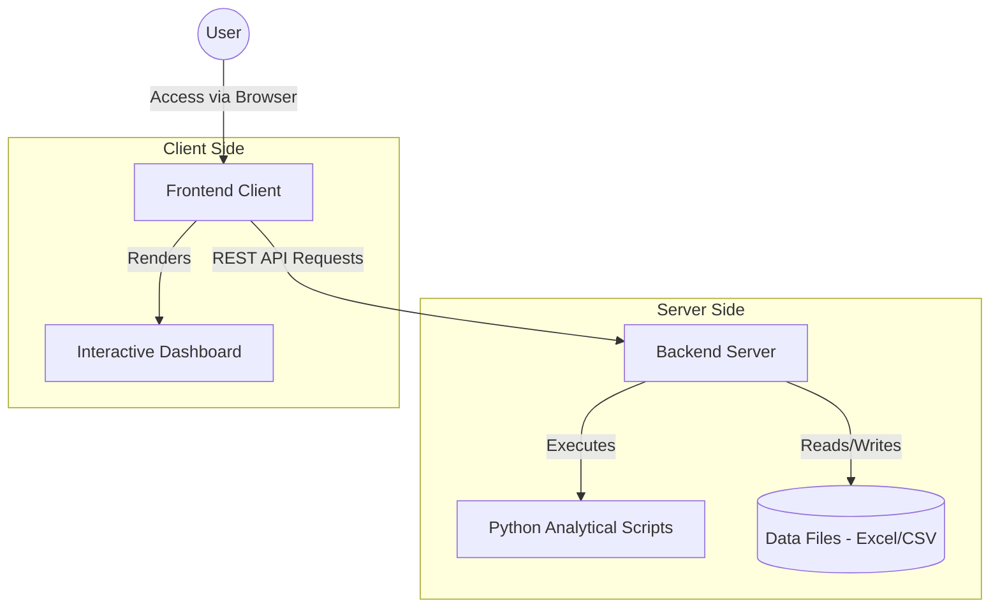
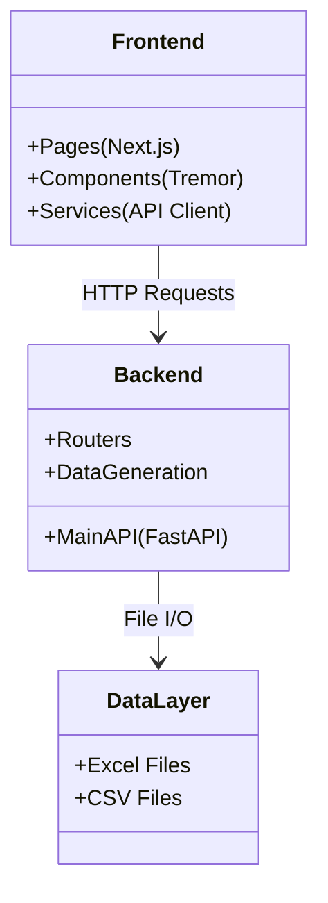
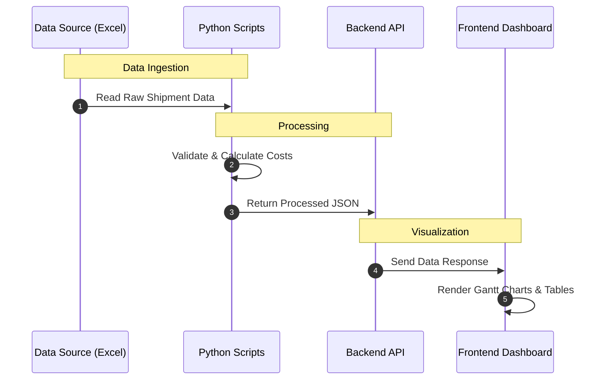

# System Architecture

## 1. High-Level Overview

The system follows a modern client-server architecture, designed to process logistics data and visualize it through an interactive dashboard.

## 2. Component Architecture

The application is divided into a **Next.js Frontend** for the user interface and a **FastAPI Backend** for data processing and logic execution.

### Frontend (`/frontend`)
- **Technology**: Next.js 14, React, TypeScript
- **State Management**: React Hooks & Context
- **UI Library**: Tremor (Charts), Headless UI, Tailwind CSS

### Backend (`/backend`)
- **Technology**: Python, FastAPI, Uvicorn
- **Core Responsibilities**:
    - **API Layer**: Exposes endpoints for the frontend.
    - **Data Processing**: Uses `pandas` and `openpyxl` to manipulate Excel data.
    - **Script Execution**: Triggers standalone Python scripts in the `/scripts` directory.

## 3. Data Processing Pipeline

The core value of the system is the transformation of raw logistics data into actionable insights.

## 4. Folder Structure & Responsibilities

| Directory | Responsibility | Key Files |
|-----------|----------------|-----------|
| `frontend/` | Web Interface | `app/`, `components/`, `lib/` |
| `backend/` | API Server | `main_api.py`, `routers/` |
| `scripts/` | Business Logic | `check_invoice.py`, `check_cargo.py` |
| `data/` | Data Storage | `*.xlsx`, `*.csv` |
